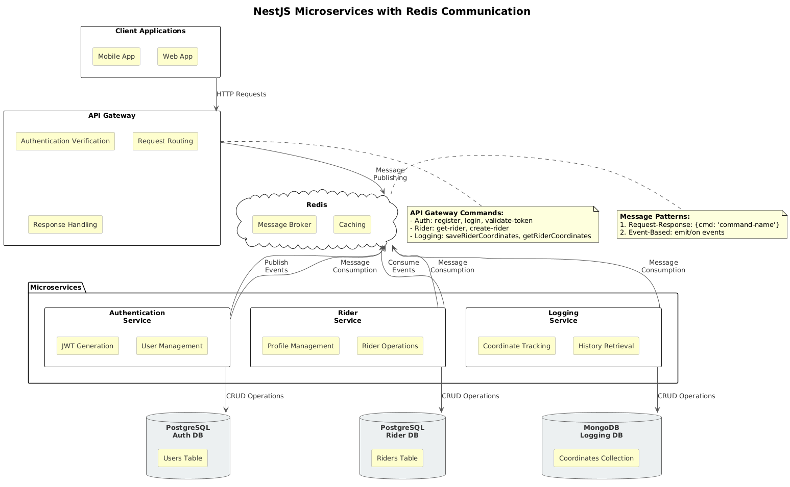

# NestJS Microservice Architecture

<p align="center">
  <a href="http://nestjs.com/" target="blank"></a>
</p>

<p align="center">A comprehensive microservices architecture built with NestJS, implementing a ride-sharing platform with multiple services.</p>

## 📚 Table of Contents

- [Architecture Overview](#architecture-overview)
- [Features](#features)
- [Prerequisites](#prerequisites)
- [Technology Stack](#technology-stack)
- [Installation](#installation)
- [Running the Services](#running-the-services)
- [API Documentation](#api-documentation)
- [Testing](#testing)
- [Project Structure](#project-structure)
- [Database Schema](#database-schema)
- [Redis Communication Patterns](#redis-communication-patterns)
- [Contributing](#contributing)
- [License](#license)

## 🏗️ Architecture Overview

This project demonstrates a microservices architecture using NestJS, consisting of the following services:

- **API Gateway**: Entry point for all client requests, handles routing and authentication verification
- **Authentication Service**: Manages user registration, login, and JWT token generation
- **Rider Service**: Handles rider profile management and operations
- **Logging Service**: Centralized logging system for tracking rider coordinates

The services communicate with each other using Redis as a message broker, implementing both synchronous and asynchronous communication patterns.



## ✨ Features

- **Microservice Architecture**: Modular, scalable design with separate concerns
- **API Gateway Pattern**: Single entry point for all client requests
- **Authentication & Authorization**: JWT-based auth with role-based access control
- **Redis-based Communication**: Services communicate using Redis pub/sub and message patterns
- **Multiple Databases**: MongoDB for logs, PostgreSQL for rider and auth data
- **Cache Layer**: Redis for improved performance and communication
- **Docker Support**: Containerized development and deployment
- **Swagger Documentation**: API endpoints documentation

## 📋 Prerequisites

- Node.js (v16+)
- Docker and Docker Compose
- pnpm (or npm/yarn)

## 🛠️ Technology Stack

- **Framework**: NestJS
- **Language**: TypeScript
- **Databases**:
  - MongoDB (for logging service)
  - PostgreSQL (for authentication and rider services)
  - Redis (for inter-service communication and caching)
- **Message Broker**: Redis (using NestJS Microservices Transport)
- **Containerization**: Docker & Docker Compose
- **API Documentation**: Swagger
- **Authentication**: JWT, Passport

## 📥 Installation

1. Clone the repository:

```bash
git clone https://github.com/your-username/nestjs-microservice.git
cd nestjs-microservice
```

2. Install dependencies:

```bash
pnpm install
# or
npm install
```

3. Start the required infrastructure services using Docker:

```bash
docker-compose up -d
```

This will start MongoDB, PostgreSQL, and Redis services as defined in the docker-compose.yml file.

## 🚀 Running the Services

### Starting All Microservices

You can start all microservices in development mode with:

```bash
# Start the authentication service
pnpm run start:dev authentication

# Start the rider service
pnpm run start:dev rider

# Start the logging service
pnpm run start:dev logging

# Start the API gateway (start this last)
pnpm run start:dev api-gateway
```

Alternatively, you can open multiple terminal windows and run each service separately for better log visibility.

### Service Ports

- API Gateway: http://localhost:3000
- Authentication Service: http://localhost:3001 (internally using Redis)
- Rider Service: http://localhost:3002 (internally using Redis)
- Logging Service: http://localhost:3003 (internally using Redis)

## 📝 API Documentation

Once the services are running, you can access the Swagger API documentation at:

- API Gateway: http://localhost:3000/api
- Authentication Service: http://localhost:3001/api
- Rider Service: http://localhost:3002/api
- Logging Service: http://localhost:3003/api

## 🧪 Mock HTTP Requests

Here are some example requests to test the system:

### Authentication Service

#### Register a new user

```bash
curl -X POST http://localhost:3000/auth/register \
  -H "Content-Type: application/json" \
  -d '{
    "email": "user@example.com",
    "password": "password123",
    "fullName": "Test User"
  }'
```

#### Login

```bash
curl -X POST http://localhost:3000/auth/login \
  -H "Content-Type: application/json" \
  -d '{
    "email": "user@example.com",
    "password": "password123"
  }'
```

This will return a JWT token that you'll use for authenticated requests.

### Rider Service

#### Create a new rider (requires authentication)

```bash
curl -X POST http://localhost:3000/riders \
  -H "Content-Type: application/json" \
  -H "Authorization: Bearer YOUR_TOKEN_HERE" \
  -d '{
    "name": "Rider Name",
    "email": "rider@example.com",
    "phoneNumber": "1234567890"
  }'
```

#### Get all riders (requires authentication)

```bash
curl -X GET http://localhost:3000/riders \
  -H "Authorization: Bearer YOUR_TOKEN_HERE"
```

### Logging Service

#### Log rider coordinates (requires authentication)

```bash
curl -X POST http://localhost:3000/logging/rider-coordinates \
  -H "Content-Type: application/json" \
  -H "Authorization: Bearer YOUR_TOKEN_HERE" \
  -d '{
    "riderId": "1",
    "latitude": 40.7128,
    "longitude": -74.0060,
    "timestamp": "2025-05-12T12:00:00Z"
  }'
```

#### Get rider coordinates history (requires authentication)

```bash
curl -X GET http://localhost:3000/logging/rider-coordinates/1 \
  -H "Authorization: Bearer YOUR_TOKEN_HERE"
```

## 📁 Project Structure

```
nestjs-microservice/
├── apps/
│   ├── api-gateway/           # API Gateway microservice
│   ├── authentication/        # Authentication microservice
│   ├── logging/               # Logging microservice
│   └── rider/                 # Rider microservice
├── docker-compose.yml         # Docker services configuration
├── nest-cli.json              # NestJS CLI configuration
├── package.json               # Project dependencies and scripts
└── README.md                  # Project documentation
```

## 💾 Database Schema

### Authentication Service (PostgreSQL)

- Users table: Stores user credentials and profile information

### Rider Service (PostgreSQL)

- Riders table: Stores rider profile information

### Logging Service (MongoDB)

- RiderCoordinates collection: Stores location tracking data

## 🔄 Redis Communication Patterns

In this architecture, Redis serves as the key communication mechanism between the microservices:

### Message Patterns

1. **Request-Response (Synchronous Communication)**

   - The API Gateway sends commands to the appropriate service
   - Each microservice listens for specific commands on its Redis channel
   - Example: When a client requests rider information, the API Gateway sends a `{cmd: 'get-rider'}` message to the Rider service

2. **Event-Based (Asynchronous Communication)**
   - Services can emit events that other services can react to
   - Example: When a new rider is created in the Authentication service, it emits an event that the Rider service consumes

### Service Communication Flow

1. **API Gateway to Authentication Service**

   - Handles user registration and login requests
   - Commands: `register`, `login`, `validate-token`

2. **API Gateway to Rider Service**

   - Manages rider information
   - Commands: `get-rider`, `create-rider`

3. **API Gateway to Logging Service**

   - Tracks rider coordinates
   - Commands: `saveRiderCoordinates`, `getRiderCoordinates`

4. **Authentication Service to Rider Service**
   - Creates rider profiles after user registration
   - Command: `create-rider`

### Benefits of Redis Communication

- **Low Latency**: Redis provides fast message delivery
- **Reliable Messaging**: Messages are stored until consumed
- **Scalability**: Multiple instances of services can consume from the same queue
- **Decoupling**: Services can evolve independently
- **Resilience**: If a service is temporarily down, messages are preserved

## 🤝 Contributing

Contributions are welcome! Please feel free to submit a Pull Request.

1. Fork the repository
2. Create your feature branch (`git checkout -b feature/amazing-feature`)
3. Commit your changes (`git commit -m 'Add some amazing feature'`)
4. Push to the branch (`git push origin feature/amazing-feature`)
5. Open a Pull Request

## 📄 License

This project is [MIT licensed](LICENSE).
